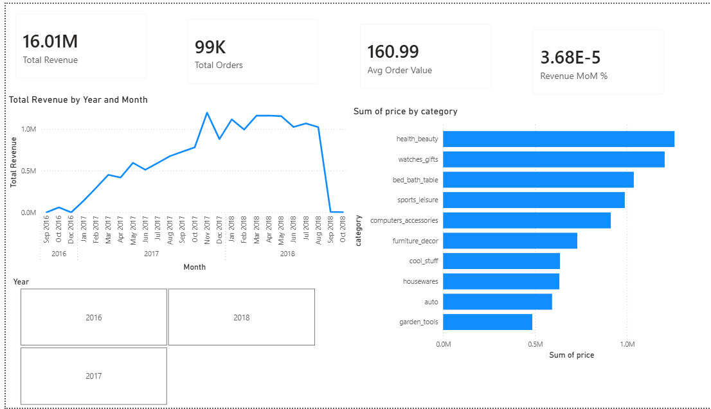
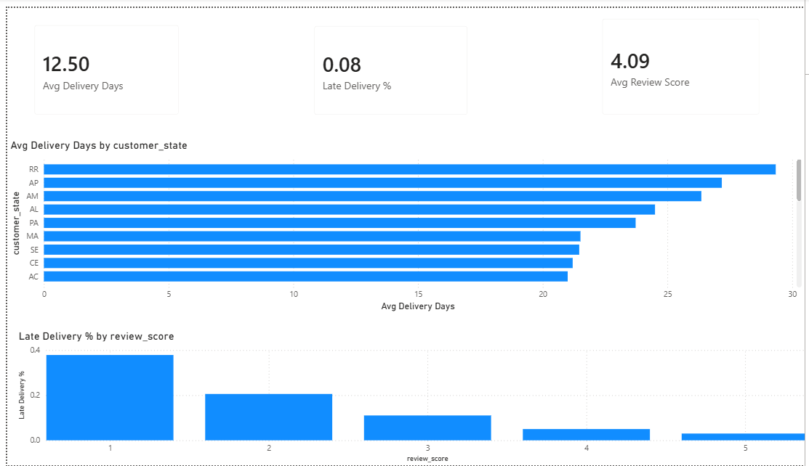
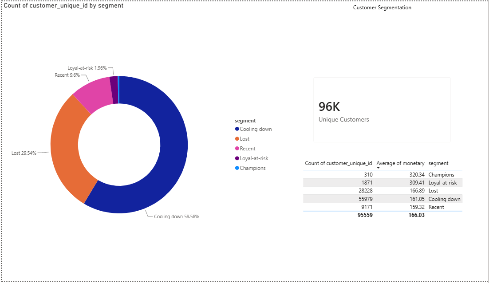

# 🛒 E-Commerce Analytics — SQL + Power BI Dashboard

An end-to-end analytics project on the **Brazilian E-Commerce (Olist)** dataset: raw CSVs loaded into **SQL Server**, transformed with **SQL views & window functions**, and visualized in an interactive **3-page Power BI dashboard**.

**Scale:** ~100K orders · 1.5M+ rows across 9 tables · Sep 2016 → Oct 2018

---

## 📊 Dashboard Pages

### 1. Revenue Overview
KPIs (Total Revenue, Orders, AOV, MoM growth) · monthly revenue trend · top 10 product categories · year slicer.



### 2. Delivery & Satisfaction
Avg delivery days · late-delivery % · avg review score · delivery time by state · **review score vs late-delivery %** (the key insight).



### 3. Customer Segmentation (RFM)
Customers split into **Champions / Loyal-at-risk / Recent / Cooling down / Lost** using Recency-Frequency-Monetary logic, with a donut chart and a per-segment spend table.



---

## 🔑 Key Insights

| # | Finding |
|---|---------|
| 1 | **`health_beauty` and `watches_gifts`** are the top revenue categories. |
| 2 | **Late delivery is the #1 driver of bad reviews** — 1-star orders are late ~40% of the time vs ~2% for 5-star. |
| 3 | Northern states (RR, AP, AM) wait **~28 days** for delivery vs the national avg of 12.5. |
| 4 | **~2,200 high-value customers** (Champions + Loyal-at-risk) spend nearly **2× the average** — a clear VIP retention target. |
| 5 | **~30% of customers are "Lost"** — a large re-engagement opportunity. |

---

## 🛠️ Tech Stack

| Layer | Tools |
|-------|-------|
| Database | SQL Server 2022 |
| Transformation | T-SQL — CTEs, window functions (`LAG`), `OUTER APPLY`, views |
| Visualization | Power BI Desktop (DAX measures, star schema, RFM) |
| Loading | `BULK INSERT` / Python (`pyodbc`) |

---

## 📁 Structure

```
ecommerce-sql-dashboard/
├── sql/
│   ├── 01_create_and_load.sql      # database + tables + bulk load
│   ├── 02_analysis_queries.sql     # 6 analytical queries
│   ├── 03_views_for_powerbi.sql    # 3 views feeding the dashboard
│   └── load_data.py                # alternative Python loader
├── powerbi/
│   ├── Olist_Dashboard.pbix        # the dashboard
│   └── DAX_measures.txt            # all DAX measures
└── images/                         # dashboard screenshots
```

---

## ▶️ How to Run

1. **Get the data:** download the [Brazilian E-Commerce dataset](https://www.kaggle.com/datasets/olistbr/brazilian-ecommerce) from Kaggle → put the CSVs in a `data/` folder.
2. **Build the database:** run `sql/01_create_and_load.sql` (update the `@dir` path to your `data/` folder).
3. **Create the views:** run `sql/03_views_for_powerbi.sql`.
4. **Open the dashboard:** open `powerbi/Olist_Dashboard.pbix` → refresh (server `localhost`, database `OlistEcommerce`).

---

## 🧠 SQL Techniques Demonstrated
- Multi-table joins (`INNER` / `LEFT`) with correct `NULL` handling
- Window function `LAG()` for month-over-month growth
- CTEs for readable, layered logic
- `OUTER APPLY` for per-row aggregation inside views
- Conditional aggregation (`SUM(CASE WHEN …)`) for rates
- RFM customer segmentation from raw transactions
